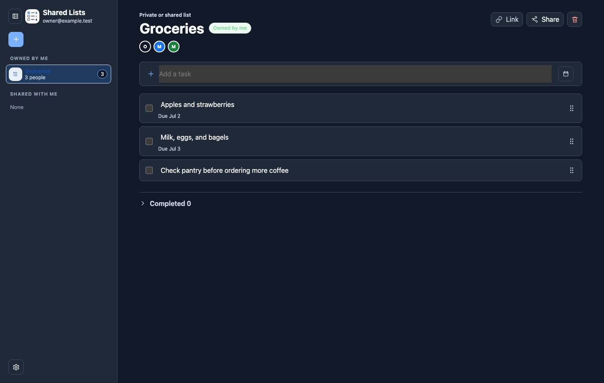
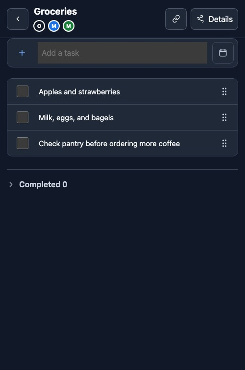

# Shared Lists Starter

Shared Lists Starter is a small private-list app you can run for a family, team, club, or project group. It gives each list its own members, sharing controls, task history, and installable PWA shell.

The app is intentionally plain:

- Sign in with the host identity system.
- Create a list.
- Add people by email.
- Share a list link.
- Show new users a quick overview tour.
- Help users install the app to their phone or desktop.
- Keep list access in the app, not in a manually managed audience file.

This repository is the reusable starter for the app. It should not contain private deployment IDs, personal emails, live private URLs, private contacts, secrets, or deployment-specific integration details.

## Screenshots





## Quick Start

Use this when you want to run the app locally before choosing a host.

Required runtime:

- Node `>=24 <27`
- npm `>=10`

Clone the repository URL shown by GitHub, then run:

```bash
cd shared-lists-starter
npm ci
npm run dev
```

Open the local URL printed by the dev server, usually:

```text
http://localhost:8001
```

The local server starts with an empty in-memory database. It is for development only.

To use your own email locally, start the server with:

```bash
DEV_DEFAULT_USER_EMAIL="$OWNER_EMAIL" npm run dev
```

Set `OWNER_EMAIL` to the real email address you want to use in local development.

Run the full check:

```bash
npm test
npm run build
```

## Configure The App

Edit `shared-lists.config.json` for user-visible and client-side settings:

```json
{
  "appName": "Shared Lists",
  "publicUrl": "",
  "feedbackEmail": "",
  "authProvider": "openai-sites",
  "features": {
    "quickActionBridge": false,
    "accessAudit": false,
    "peopleImport": false,
    "privateGoogleContacts": false
  },
  "quickActionBridge": {
    "allowedOrigins": []
  }
}
```

Use host environment variables for server-side settings. For local development, copy `.env.example` to `.env`; the dev server loads `.env` automatically. Do not commit real secrets or private deployment IDs. Optional admin and integration surfaces, including access audit, people import, quick-action intake, and private Google Contacts autocomplete, are disabled by config until you turn them on.

Set `publicUrl` and `feedbackEmail` only when you have real values. If `feedbackEmail` is empty, the app hides Feedback and Help/questions.

## Pick A Hosting Lane

You can deploy this starter two ways.

### Option A: OpenAI Sites

Choose this if you are working inside Codex with Sites available and want the shortest path.

1. Keep `shared-lists.config.json` set to `"authProvider": "openai-sites"`.
2. Keep `.openai/hosting.json` without a `project_id` until you create your own site.
3. Ask Codex to deploy the repo with OpenAI Sites.
4. Set the Sites app to public if you want anyone with a list link to reach the app shell.
5. Rely on list-level permissions for actual list data.
6. Sign in, create your first list, and add members.

Detailed steps: [`docs/DEPLOY_OPENAI_SITES.md`](docs/DEPLOY_OPENAI_SITES.md).

### Option B: Cloudflare Workers + D1 + Cloudflare Access

Choose this if you want to own the Cloudflare account, DNS, Access policy, and D1 database.

Current status: the Cloudflare lane documents the intended shape, but it is not yet executable end to end. The repo still needs working Cloudflare deploy/migrate/rollback commands and a real production-system smoke test. Those gaps are tracked in [`docs/DEPLOY_CLOUDFLARE.md`](docs/DEPLOY_CLOUDFLARE.md) and [`docs/ROADMAP.md`](docs/ROADMAP.md).

1. Copy `wrangler.toml.example` to `wrangler.toml`.
2. Create a Cloudflare D1 database.
3. Fill in the D1 database ID and Cloudflare Access values.
4. Set `shared-lists.config.json` to `"authProvider": "cloudflare-access"`.
5. Run migrations.
6. Build and deploy with Wrangler.
7. Protect the Worker route with Cloudflare Access.

Detailed steps: [`docs/DEPLOY_CLOUDFLARE.md`](docs/DEPLOY_CLOUDFLARE.md).

## First Owner Setup

For a fresh deployment, decide who may claim the first list.

Set this server-side value before the first production deploy:

```text
FIRST_OWNER_EMAILS=
```

Set `FIRST_OWNER_EMAILS` to the real email address, or comma-separated real email addresses, allowed to create the first list. Leave it blank only if any signed-in user should be allowed to claim the first list while the database is empty.

Then sign in as that email and either create the first list in the app UI or call the setup endpoint. Set `APP_URL` to the deployed app URL and `FIRST_LIST_TITLE` to the real list name before running this command:

```bash
curl -X POST "$APP_URL/api/setup/first-owner" \
  -H "content-type: application/json" \
  -d "{\"title\":\"$FIRST_LIST_TITLE\"}"
```

If no `FIRST_OWNER_EMAILS` value is set, any signed-in user may claim first-owner setup while the database has no lists. Once the first list exists, the setup endpoint returns `409`.

You can also claim setup by signing in as an allowed owner and creating the first list from the app UI.

Detailed steps: [`docs/FIRST_OWNER_SETUP.md`](docs/FIRST_OWNER_SETUP.md).

## Questions And Answers

### Can I build my own version without an agent?

Yes. The normal path is `git clone`, `npm ci`, `npm run dev`, `npm run check`, then deploy through either OpenAI Sites or Cloudflare.

For today, OpenAI Sites is the more complete deployment lane. Cloudflare is a documented lane with unfinished deployment automation.

### Can I point Codex, Claude Code, or another coding agent at this repo?

Yes. Give the agent [`AGENT_README.md`](AGENT_README.md) and ask it to follow the lane you choose. The repo includes `AGENTS.md` and `CLAUDE.md` with project rules for agentic setup and deployment.

### Is the app public?

The app shell can be public. Lists are not public by default. The API checks the signed-in user against each list's membership before returning list data.

### How do I share one list quickly?

Open the list, tap Share, add the person's email, then copy or send the list link. A person who is not on that list sees no list data.

### Can sharing autocomplete use my contacts?

Optionally, yes. Private Google Contacts autocomplete is off by default. If a deployer enables it and a user connects their own Google account in Settings, only that user sees those private suggestions. Everyone can still share by typing a full email address.

The shared people directory is scoped to people who already share at least one list with the signed-in user. The app does not send the full global user table to every browser.

### Can a member add other people?

The list owner can grant sharing permission to a member. Members with sharing permission can add people to that list.

### What is not included?

The starter does not include a hosted public demo, production Cloudflare automation, a production-system smoke test, private personal automations, private deployment IDs, personal git history, or private personal integrations. Optional external integrations should live in a separate adapter or fork and stay disabled by config until a deployer intentionally enables them.

## What An Open-Source Maintainer Would Expect

The repo includes the core public-project surface:

- Apache-2.0 license.
- README, changelog, roadmap, support, security, conduct, governance, and maintainer docs.
- GitHub Actions CI, Dependabot, issue templates, pull request template, and CODEOWNERS.
- Local development instructions.
- Deployment docs for OpenAI Sites and a marked-incomplete Cloudflare lane.
- Privacy/data-lifecycle docs.
- Accessibility target and release checklist.
- Desktop and mobile screenshots.

Important follow-ups before a production Cloudflare release:

- Make the Cloudflare instructions executable.
- Test the production system, not just its components.
- Add a hosted demo only after it has dedicated non-production storage and synthetic data.

### Which license does this use?

Apache License 2.0. See [`LICENSE`](LICENSE).

### What release is this?

`v0.1.0` is the first pre-1.0 starter release. See [`docs/RELEASES.md`](docs/RELEASES.md) and [`docs/ROADMAP.md`](docs/ROADMAP.md).

## Project Layout

```text
src/                 app shell, Worker entrypoint, API router, store layer
drizzle/             D1-compatible migrations
db/                  schema reference
docs/                public setup, architecture, and deployment docs
examples/            hosting-lane notes
adapters/            identity-adapter notes
packages/            future reusable package boundary
tests/               API, shell, identity, and safety tests
```

## Basic Hygiene

Before opening a pull request or publishing your fork:

```bash
npm ci
npm run check
git diff --check
```

Never commit `.env`, `wrangler.toml` with real IDs, access tokens, production database exports, private emails, or deployment credentials.

For public repository settings, see [`docs/GITHUB_SETUP.md`](docs/GITHUB_SETUP.md).

For questions, use GitHub Discussions or the Help/questions action when a deployer has configured a support email.
